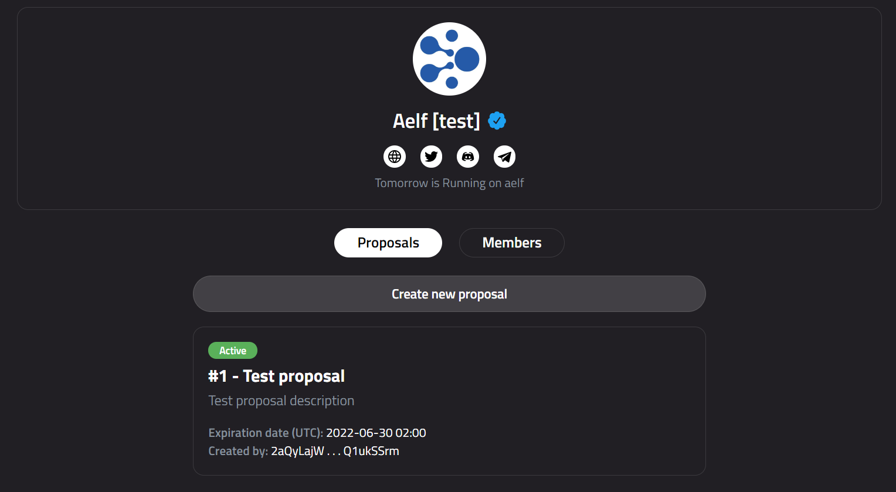

# ChainProposal

A on-chain DAO / Governance platform running on AELF Network.

-----

### This is a frontend repository.

### Repository with smart contract: https://github.com/spectralchord/ChainProposalContract

---

## Inspiration

This decentralized platform will help other projects (Launchpads, DEXs, Games and others) create on-chain proposals and allow the user to somehow control the project by voting. Thanks to the high speed of the AELF network, all actions on the platform are fast and convenient.

## Description:

Possible actions on the platform will be described below, depending on the roles.

**a. All users:**
- Create an organization or project profile;
- Vote on proposals (only once for each proposals);

**b. Creators of the organization:**
- Create voting proposals;
- Add new members (authors) or remove them from the organization;

**c. Members of the organization:**
- Create voting proposals;

**d. Admin of ChainProposal platform:**
- Verify organization profiles (a check mark will appear);

**An organization profile contains the following information:**
- Name of the organization
- Short Description
- Logo
- Links to website and social networks (Twitter, Telegram, Discord)

**Proposal page contains the following information:**
- Proposal name;
- Proposal description;
- Voting options;
- Proposal tatus (active or completed);
- Voting deadline;
- Current results;
- List of voters;

---

## How I built it:

First, was created a smart contract in C# using the `aelf` library, which creates a contract template.

After implementing all the necessary methods and testing the smart contract, I started creating the application interface.

For the frontend, I used HTML / JS / CSS  and the `aelf sdk` library to interact with the blockchain.

Before deploying the contract to the public testnet network (tDVW), I've deployed the contract to the local network.

I also made it possible to connect the wallet to the platform using the web extension `aelf-web-extension`.

After all this, the contract was deployed to the public testnet (tDVW).

## Challenges I ran into

The following was difficult:
- figure out how to start a local network
- understand the process of deploying a contract to a public testnet (creating a proposal, etc.)

## What I learned 

It was interesting to learn and study how the AELF blockchain works, at least the basic things. 

Also, writing a contract in C# was something new and interesting for me. 

## What's next for ChainProposals

Add the ability to specify conditions that voters must meet to be able to vote on proposals

# UI

